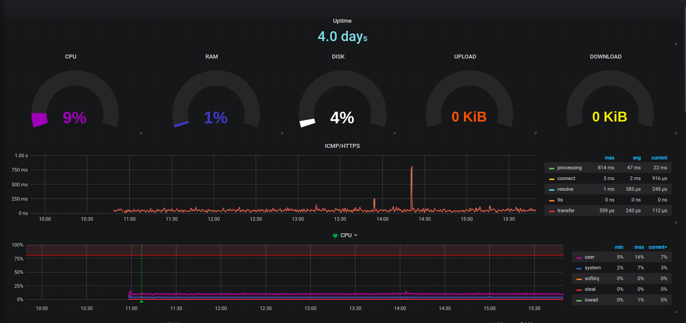
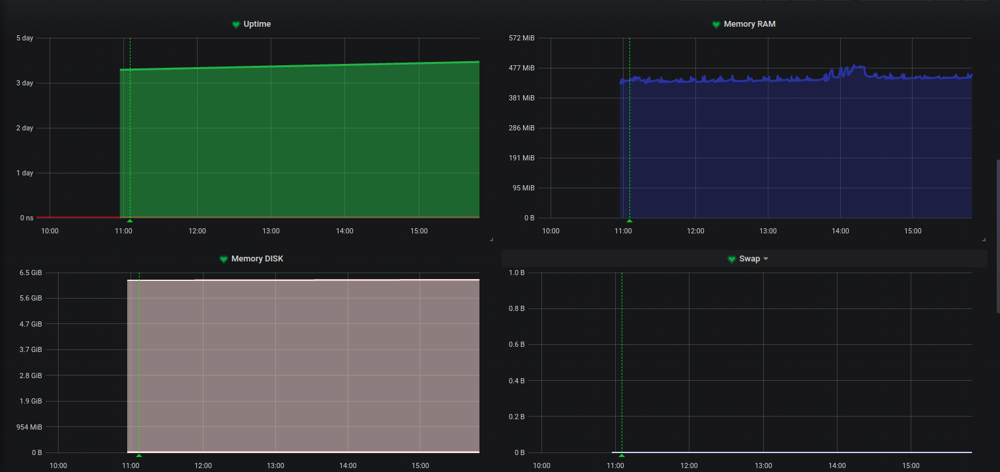
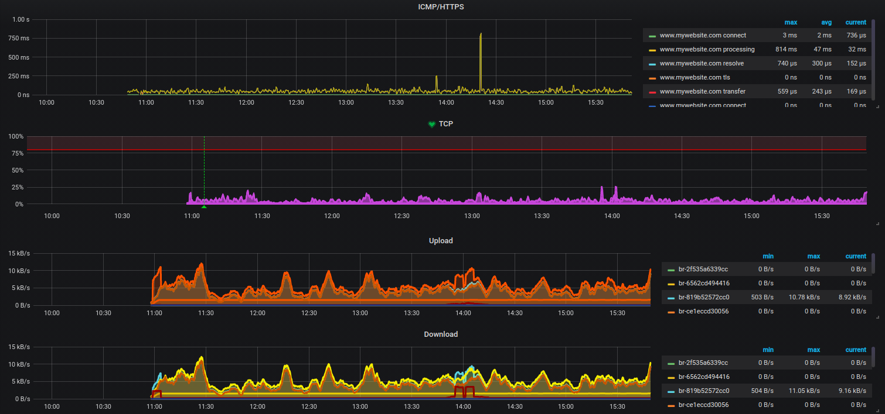
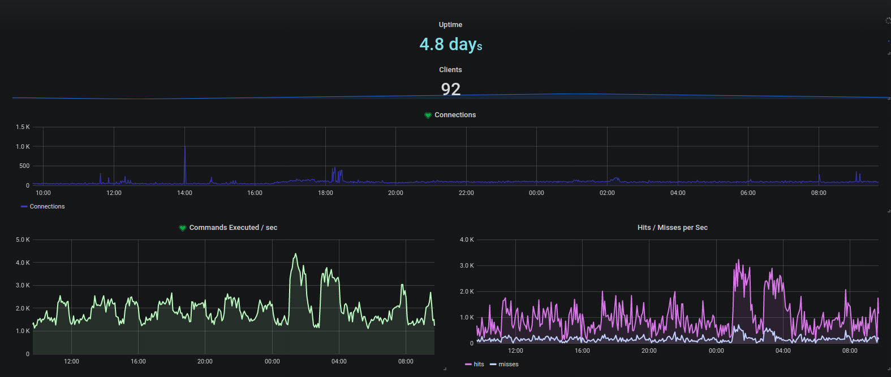
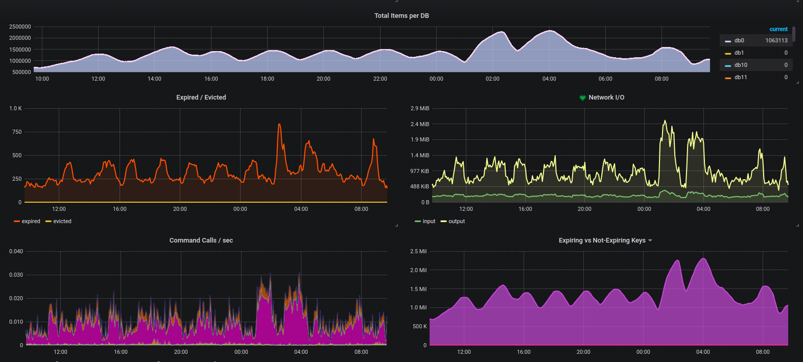

# GRAFANA + PROMETHEUS + ALERT
### Dashboard example for alerts in Grafana using Prometheu
### **Exporters**
- node_exporter
- blackbox_exporter
### **Install in Linux app monit**

- [Grafana + Prometheus + node+exporter + blackbox+exporter](https://github.com/luizgustavo77/Notes/blob/master/Cloud/Linux/Grafana_Prometheus.md)

- [Json](https://github.com/luizgustavo77/Grafana/blob/master/dashboard/luizgustavo77-github-SERVER.json)

### **Install in Linux Redis monit**
- [Grafana + Prometheus + redis_exporter](https://github.com/luizgustavo77/Estudos/blob/master/Grafana_Prometheus.md)

- [Json](https://github.com/luizgustavo77/Grafana/blob/master/dashboard/luizgustavo77-github-REDIS.json)

